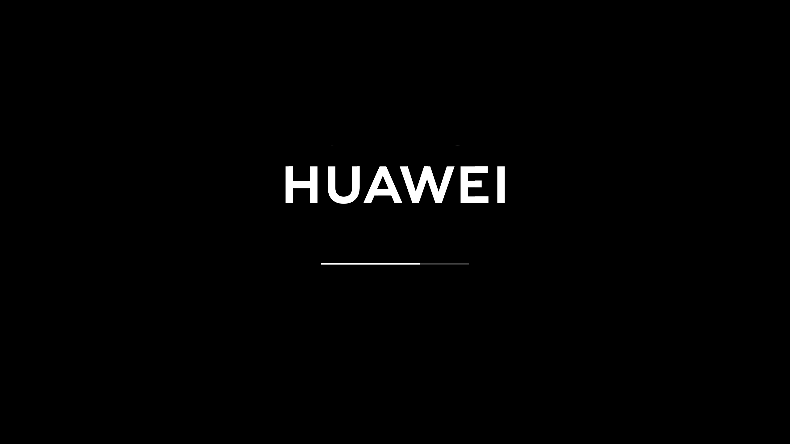
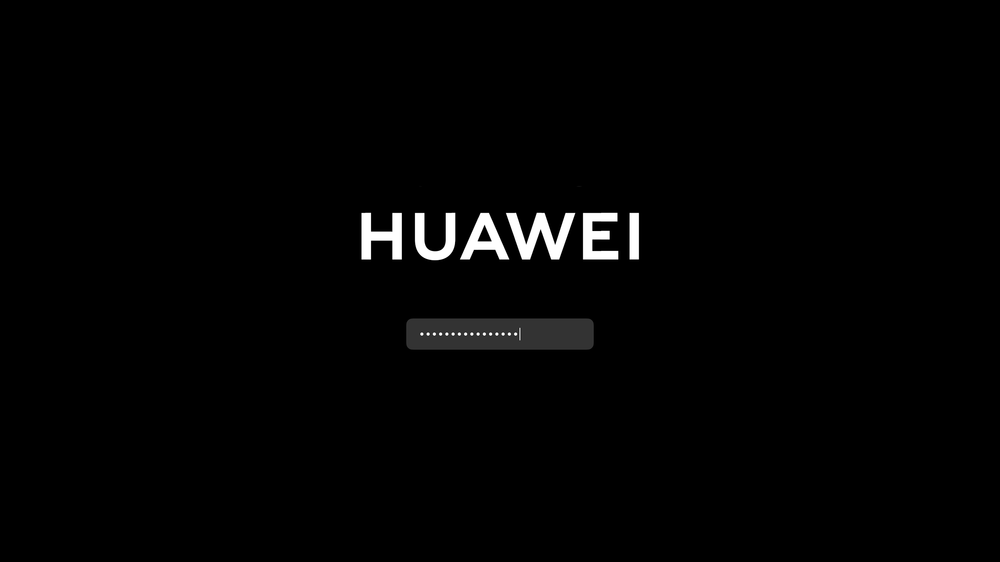

# Plymouth Theme Neat Huawei
HiDPI-Friendly Plymouth Theme with huawei vendor logo.

Based on the original [Plymouth Theme Neat](https://github.com/neetly/plymouth-theme-neat) for Arch Linux.

| Default                                          | Password                                           |
| ------------------------------------------------ | -------------------------------------------------- |
|  |  |


## Install theme
```sh
sudo cp -r src/ /usr/share/plymouth/themes/neat-huawei
sudo plymouth-set-default-theme -R neat-huawei
```

## Uninstall theme
```sh
sudo rm -rf /usr/share/plymouth/themes/neat-huawei
sudo plymouth-set-default-theme -R bgrt
```
